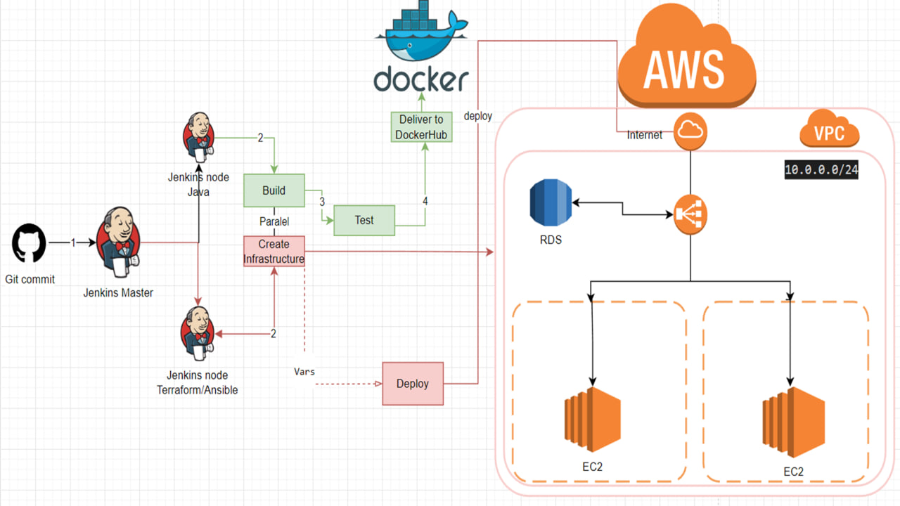

# Deploy-Java-Jenkins-Terraform-AWS-Ansible
## This is The Final task for EPAM Cloud&amp;DevOps Fundamentals Autumn 2022

This project was created by me as part of my studies at Epam. In the project, I used my knowledge of CI/CD and IaC, Cloud, Docker, Linux, and Networking.
The project is a CI / CD pipeline that receives changes to the repository via a webhook and triggers the assembly of a Java Spring application in parallel with launching the infrastructure with Terraform in AWS. Existing terraform files create a complete infrastructure from scratch VPC RDS ELB ASG SG and others. After success, we have a stage with maven autotest. Next comes the build and delivery of the image to the docker hub. And finally, we deploy an ansible playbook with configuration for instances and running a container. There are also optional stages such as approval, destroy, and notification.

### Diagram CD/CD pipeline 

### To start the project, the following conditions must be met:
    - Account on AWS.
    - Must be launched on the AWS 3 instance: Jenkins Master server and two of its nodes(one for the IaC, one for the build application)
    - Install OpenJDK-17 on all servers and Jenkins on Master. On the node for the IaC install Terraform and Ansible, on build server - docker.
    - Add ssh keys to nodes. Connect.
    - Create pipeline and add SCM.
    - Сonfigure webhook to Jenkins master.
    - Set all Credentials: access and Secret key to AWS, password and user to MySQL, docker, and email for failure notification.
    - S3 bucket for remote state file. 
